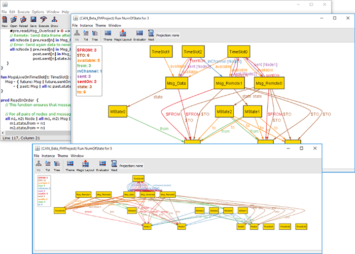

# CANBus
Basic Model of Controller Area Network (CAN bus).

A Controller Area Network (CAN bus) is a vehicle bus standard designed to allow microcontrollers and devices to communicate with each other in applications without a host computer on subscriber bus. It is a message-based protocol, designed for multiplex electrical wiring within automobiles and other contexts. The devices that are connected by a CAN network are typically sensors, actuators, and other control devices.

CAN is a multi-master serial bus standard for connecting Electronic Control Units (ECUs) also known as nodes. Two or more nodes are required on the CAN network to communicate. Each node is able to send and receive messages, but not simultaneously. A message or Fr ame consists primarily of the ID (identifier), which represents the priority of the message, and data bytes. The message is transmitted serially onto the bus and may be received by all nodes.

## Author

[Hadi Abdi Khojasteh](http://hadiabdikhojasteh.ir)

## Copyright

Copyright (c) 2017 Hadi Abdi Khojasteh

## License

GNU General Public License v3.0
